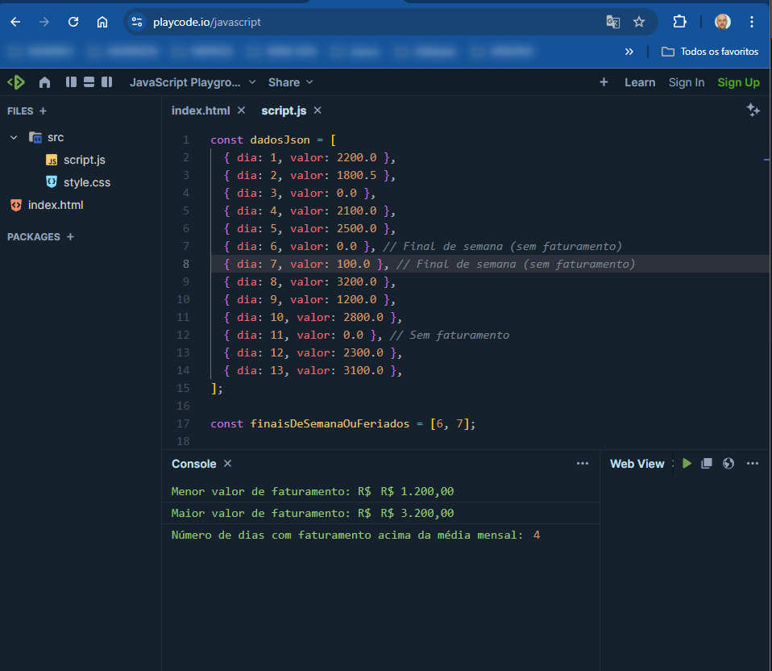

---

### 📂 **README para JavaScript (com JSON)**:

```markdown
# 🚀 Calculando o menor, maior faturamento e dias acima da média (JavaScript) usando JSON como fonte de dados

## 🛠️ O que é o PlayCode.io?
O **PlayCode.io** é uma ferramenta online onde você pode escrever, executar e testar código JavaScript diretamente no navegador, sem precisar instalar nada.

### 🔗 Acesse o PlayCode.io aqui: [PlayCode.io](https://playcode.io/javascript)

---

## 📋 Passo a Passo no PlayCode.io

### 1️⃣ **Acesse o link do PlayCode.io**
- Abra o navegador e vá até o **[PlayCode.io](https://playcode.io/javascript)**.

### 2️⃣ **Remova o código padrão**
- No editor que aparece na tela, apague o código padrão para que possamos inserir o nosso código.

### 3️⃣ **Cole o código JavaScript abaixo no editor**:

```javascript
const dadosJson = [
  { dia: 1, valor: 2200.0 },
  { dia: 2, valor: 1800.5 },
  { dia: 3, valor: 0.0 },
  { dia: 4, valor: 2100.0 },
  { dia: 5, valor: 2500.0 },
  { dia: 6, valor: 0.0 }, // Final de semana (sem faturamento)
  { dia: 7, valor: 0.0 }, // Final de semana (sem faturamento)
  { dia: 8, valor: 3200.0 },
  { dia: 9, valor: 1400.0 },
  { dia: 10, valor: 2800.0 },
  { dia: 11, valor: 0.0 }, // Sem faturamento
  { dia: 12, valor: 2300.0 },
  { dia: 13, valor: 3100.0 },
];

let total = 0;
let menor = null;
let maior = null;
let diasComFaturamento = 0;
let diasAcimaDaMedia = 0;

dadosJson.forEach((dado) => {
  if (dado.valor > 0) {
    // Ignorar dias sem faturamento
    if (menor === null || dado.valor < menor) {
      menor = dado.valor;
    }
    if (maior === null || dado.valor > maior) {
      maior = dado.valor;
    }

    total += dado.valor;
    diasComFaturamento++;
  }
});

let media = diasComFaturamento > 0 ? total / diasComFaturamento : 0;

dadosJson.forEach((dado) => {
  if (dado.valor > media) {
    diasAcimaDaMedia++;
  }
});

console.log(
  "Menor valor de faturamento: R$",
  menor.toLocaleString("pt-BR", { style: "currency", currency: "BRL" })
);
console.log(
  "Maior valor de faturamento: R$",
  maior.toLocaleString("pt-BR", { style: "currency", currency: "BRL" })
);
console.log(
  "Número de dias com faturamento acima da média mensal:",
  diasAcimaDaMedia
);

```
### 4️⃣ Execute o código 🏃‍♂️
O PlayCode.io executa o código automaticamente. Se não executar, clique no botão Run (Executar) na parte superior direita da página.

### 5️⃣ Veja o resultado no painel de saída 🎉
O resultado do código será exibido no console. O programa retornará o menor, o maior valor de faturamento, e quantos dias tiveram faturamento acima da média mensal.



## 🔄 O que aprendemos?
- Como carregar e manipular dados de faturamento de um JSON em JavaScript.
- Como calcular o menor, maior valor de faturamento e dias acima da média.
- Como ignorar dias sem faturamento, como finais de semana e feriados, no cálculo da média.

## 📲 Contato
Caso tenha dúvidas ou sugestões, entre em contato comigo:

- Email: gaitolini@gmail.com
- LinkedIn: [Anderson Gaitolini](https://www.linkedin.com/in/andersongaitolini/)
- Whatsapp: [Me adicione no WhatsApp](https://wa.me/qr/CFND4RGOJHHUN1)
